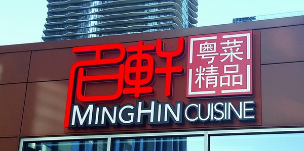

晚茶 @ 明轩
=======

比较了解中餐的吃货都知道明轩是唐人街最受欢迎的早茶饭馆之一。明轩现在也有一家处在市中心的分店，离Maggie Daley公园很近，最近的轻轨站是咖啡线的Randolph/Wabash站。下班之后想和一群友好的人一起聊天并共享美味的广东菜吗？那就赶快报名呗，席位有限制！

请记得带点现金来，这样分担会方便一些。

-----

组织者的笔记
----------

如果只有一个主持人，一般的报名上限是14位，他们最大的桌子好像只能容纳这么多人。

冒险菜准则：关于对西方人不太适应的食物（比如凤凰爪，肠子，海蜇皮，等等），我主张：

- 客人还没到齐的时候最好不要点任何冒险菜
- 点菜之前问问大家有没有什么忌口
- 一顿中可以点一两道这类的菜（由主持人来判断），如果有客人坚决要点其更多的冒险菜，告诉TA多余的冒险菜由TA自己来付钱。

我点过而比较喜欢的菜：

- 明轩虾饺皇
- 鲍汁鲜竹卷
- 黑椒牛仔骨
- 皮蛋瘦肉粥

以后应该尝试的菜：

- 贵妃奶皇包
- 蜜汁牛仔骨
- 芋丝炸春卷
- 蒜蓉炒豆苗
- 蒜蓉炒什菜
- 黑椒芦笋
- 鲜金菇瑶柱扒玉子豆腐
- 夫妻肺片
- 澳门烧腩仔
